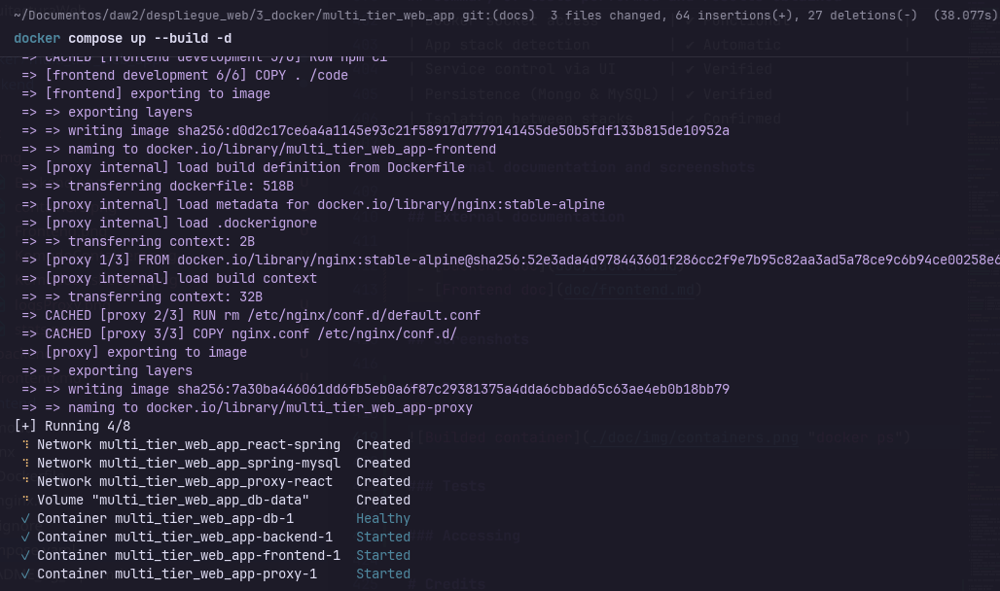
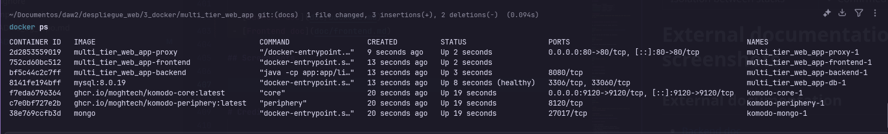
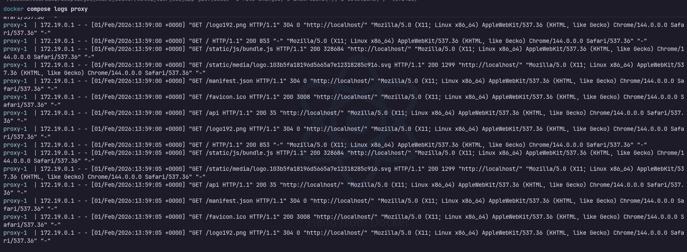
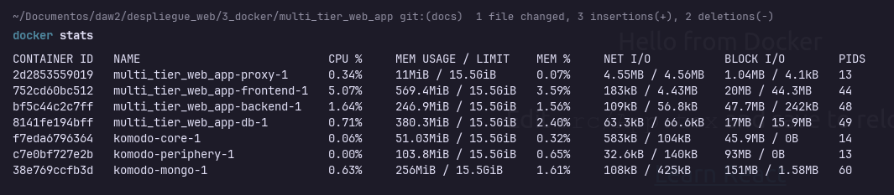
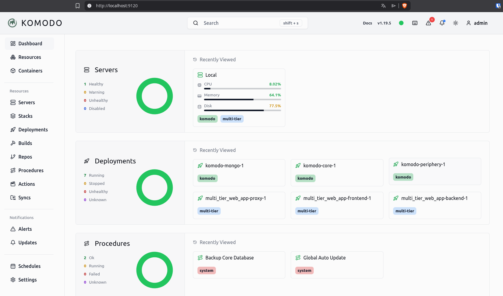
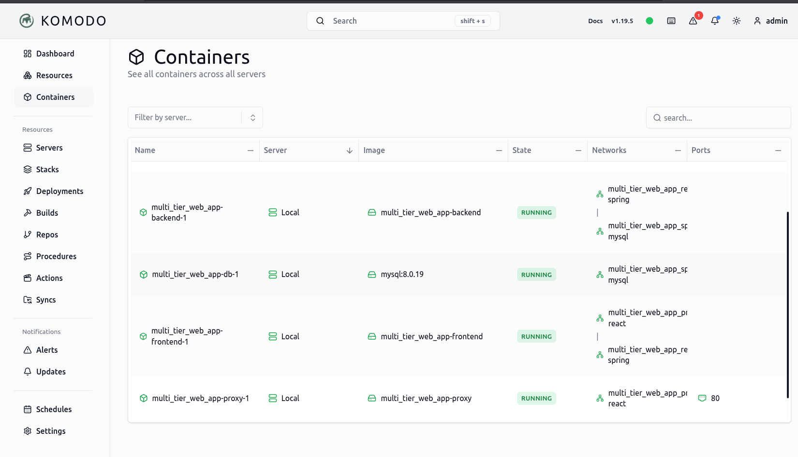
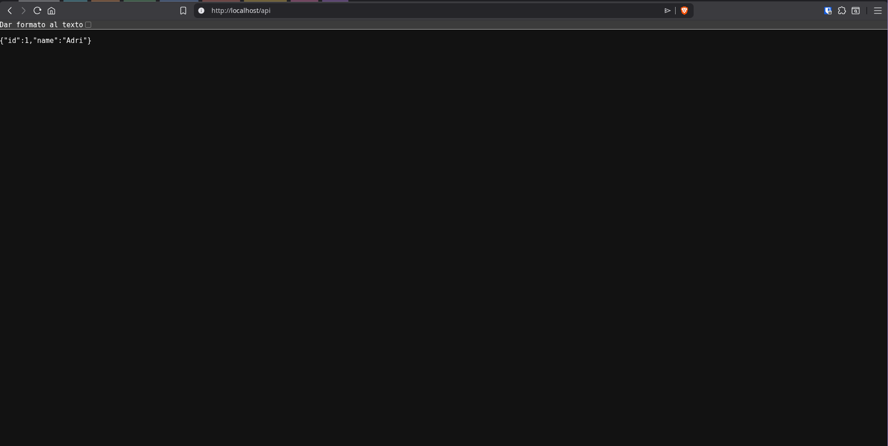

# Multi-tier web application

# Table of content

- [Multi-tier web application](#multi-tier-web-application)
- [Table of content](#table-of-content)
- [Manual](#manual)
  - [Project structure](#project-structure)
    - [Folder structure](#folder-structure)
    - [Description of each directory](#description-of-each-directory)
  - [Role of each service](#role-of-each-service)
    - [Backend (Spring Boot)](#backend-spring-boot)
    - [Database (MySQL)](#database-mysql)
    - [Frontend (React)](#frontend-react)
    - [Proxy (Nginx)](#proxy-nginx)
    - [Monitoring (Komodo stack)](#monitoring-komodo-stack)
  - [Deploying the environment](#deploying-the-environment)
    - [Requirements](#requirements)
    - [Deployment Order](#deployment-order)
    - [Deployment Steps](#deployment-steps)
      - [1. Komodo stack](#1-komodo-stack)
      - [2. App stack](#2-app-stack)
  - [Description of configurable files and network](#description-of-configurable-files-and-network)
    - [Configurable Files](#configurable-files)
    - [Networks](#networks)
  - [Starting, stopping and updating the services](#starting-stopping-and-updating-the-services)
- [Administration manual](#administration-manual)
  - [Managing the services](#managing-the-services)
  - [Security considerations and applied measures](#security-considerations-and-applied-measures)
    - [Implemented measures](#implemented-measures)
    - [Komodo specific security](#komodo-specific-security)
  - [Manteinance and scalability recommendations](#manteinance-and-scalability-recommendations)
    - [Maintenance](#maintenance)
    - [Scalability](#scalability)
  - [Summary of tests performed and results obtained](#summary-of-tests-performed-and-results-obtained)
- [External documentation and screenshots](#external-documentation-and-screenshots)
  - [External documentation](#external-documentation)
  - [Screenshots](#screenshots)
    - [Building](#building)
    - [Tests](#tests)
    - [Accessing](#accessing)
- [Credits](#credits)

---

# Manual

## Project structure

### Folder structure

```
.
├── backend
│   ├── Dockerfile
│   └── ...
├── db
│   └── password.txt
├── doc
│   ├── images
│   │       ├── screenshot.png
│   │       └── ...
│   ├── backend.md
│   └── ...
├── frontend
│   ├── Dockerfile
│   └── ...
├── komodo
│   ├── compose.yaml
│   └── compose.env
├── nginx
│   ├── Dockerfile
│   └── nginx.conf
├── compose.yaml
├── README_og_repo.md
└── README.md
```

### Description of each directory

`backend/`:
 - Contains the **Spring Boot backend application**
 - Includes a *Dockerfile* used by Docker Compose to build the backend image
 - The backend:
   - Connects to the MySQL database
   - Exposes APIs consumed by the frontend
   - Reads the database password from a Docker secret

`frontend/`:
 - Contains the **React frontend application**
 - The *Dockerfile* defines multiple stages; Compose explicitly builds the **development** stage
 - Source files are volume-mounted for live development
 - Communicates with the backend through an internal Docker network

`nginx/`:
 - Contains the **reverse proxy**
 - *nginx.conf* defines routing rules:
   - Incoming HTTP traffic (port 80)
   - Requests routed to frontend
 - Acts as the **single public entry** point to the system

`db/`:
 - Stores database-related files
 - *password.txt* is used to create a Docker secret for the MySQL root password
 - This password is never hard-coded into images or compose files

`komodo/`:
 - Contains the **Komodo infrastructure management stack**
 - Completely independent from the application stack
 - Includes:
   - `compose.yaml`: deploys Komodo Core, Periphery, and MongoDB
   - `compose.env`: configuration and secrets for Komodo
 - Used for:
   - Monitoring containers
   - Managing deployments
   - Restarting services
   - Viewing logs and system metrics

`docs/`:
 - Auxiliary project documentation
 - Images for documentation and reports

`compose.yaml`:
 - Defines:
   - All services
   - Networks
   - Volumes
   - Secrets
 - Orchestrates how containers interact with each other

## Role of each service

### Backend (Spring Boot)

 - Built from *backend/Dockerfile*
 - Responsibilities:
   - Business logic
   - Database access
   - API exposure
 - Key features:
   - Uses `MYSQL_HOST=db` to connect to the database container
   - Waits for MySQL to become healthy before starting
   - Reads DB password securely from `/run/secrets/db-password`
 - Connected to:
   - *spring-mysql* (database communication)
   - *react-spring* (frontend communication)

### Database (MySQL)

 - Uses the official `mysql:8.0.19` image
 - Responsibilities:
   - Persistent data storage
 - Key features:
   - Root password injected via Docker secret
   - Healthcheck ensures MySQL is ready before backend starts
   - Data persisted using a named volume (`db-data`)
 - Connected only to:
   - *spring-mysql* (isolated from frontend and proxy)

### Frontend (React)

 - Built from `frontend/Dockerfile`, `development` stage
 - Responsibilities:
   - User interface
   - Sends HTTP requests to backend APIs
 - Key features:
   - Source code mounted as a volume for hot reload
   - `node_modules` kept inside the container to avoid host conflicts
 - Connected to:
   - `react-spring` (backend communication)
   - `proxy-react` (nginx communication)

### Proxy (Nginx)

 - Built from `nginx/Dockerfile`
 - Responsibilities:
   - Reverse proxy
   - Single exposed entry point (`localhost:80`)
 - Key features:
   - Routes traffic internally to frontend and backend
   - No application logic
 - Connected only to:
   - `proxy-react` (frontend communication)

### Monitoring (Komodo stack)

 - Komodo Core (Central management UI and API)
 - Komodo Periphery (Interacts with the Docker daemon)
 - Komodo MongoDB (stores configuration, audit logs...)
 - Isolated from the app stack (no network connection)

> [!CAUTION]
> Komodo should be only accesible to admins or be deployed in very secure environments, as it has access to Docker root-level.

## Deploying the environment

### Requirements

 - Docker
 - Docker Compose

### Deployment Order

It is recommended to start Komodo first, followed by the application stack.

### Deployment Steps

#### 1. Komodo stack

```shell
docker compose -p komodo -f komodo/mongo.compose.yaml --env-file komodo/compose.env up -d
```

> [!TIP]
> The *-p* flag let us specify the project name, the *-f* flag tells wich compose file to use, the *--env-file* flag tells docker wich environment file to use.

Komodo UI will be available at:

`http://localhost:9120`

#### 2. App stack

```shell
docker compose up --build

# OR (if already built)
docker compose up
```

This will:

 1. Create networks and volumes
 2. Build backend, frontend, and proxy images
 3. Start MySQL
 4. Wait for DB healthcheck
 5. Start backend
 6. Start frontend
 7. Start nginx proxy

The application becomes accessible at:

`http://localhost` or `http://localhost:80`

> [!IMPORTANT]
> Once running, Komodo will automatically detect and manage the application containers.

## Description of configurable files and network

### Configurable Files

| File                   | Purpose                          |
| :--------------------- | -------------------------------: |
| `compose.yaml`         | Service orchestration            |
| `backend/Dockerfile`   | Backend image definition         |
| `frontend/Dockerfile`  | Frontend image definition        |
| `nginx/nginx.conf`     | Request routing and proxy rules  |
| `db/password.txt`      | Database root password           |
| `komodo/compose.yaml` | Komodo service definitions       |
| `komodo/compose.env`  | Komodo configuration and secrets |

> [!TIP]
> In the backend and frontend directories exists the source code for each service, to edit the code and integrate our app.

### Networks

| Network         | Purpose             |
| :-------------- | ------------------: |
| `spring-mysql`  | Backend ↔ Database  |
| `react-spring`  | Frontend ↔ Backend  |
| `proxy-react`   | Proxy ↔ Frontend    |

> [!IMPORTANT]
> This network topology ensures that each service can only talk to what it needs


## Starting, stopping and updating the services

As said before, to start the service we'll use:

```bash
docker compose up # add -d if you want to detach from terminal
```

To stop it, but keep the volumes (DB persists):

```bash
docker compose down
```

To stop and remove volumes (deletes DB data):

```bash
docker compose down -v
```

Update images:

```bash
docker compose up --build
```

---

# Administration manual

## Managing the services

View running containers:

```bash
docker compose ps
```

View logs:

```bash
docker compose logs -f backend
docker compose logs -f db
docker compose logs -f frontend
docker compose logs -f proxy
```

View stats:

```bash
docker stats
```

> [!TIP]
> You can execute commands inside containers with *docker compose exec [service name] [command]*

> [!IMPORTANT]
> Logs can be seen too in the Komodo UI

## Security considerations and applied measures

### Implemented measures

 - Secrets management
   - Database password stored as Docker secret
   - Not exposed in images or environment variables
 - Network isolation
   - Database inaccessible from frontend and proxy
 - Single public entry point
   - Only nginx exposes a port to the host
 - Healthchecks
   - Backend starts only after DB is ready

### Komodo specific security

 - Docker Socket Access
   - Komodo Periphery mounts the Docker socket
   - This grants full control over Docker and containers
 - Mitigations:
   - Restrict access to port `9120`
   - Use strong admin credentials
   - Rotate `KOMODO_PASSKEY`
   - Disable unnecessary features (terminals, webhooks)
   - Optionally place Komodo behind VPN or reverse proxy

Also, the next improvements could help in the security aspect:

 - Use non-root MySQL user
 - Enable HTTPS in nginx
 - Add Spring Boot security (JWT or OAuth2)
 - Use `.env` for environment-specific configs

## Manteinance and scalability recommendations

### Maintenance

 - Regularly update base images
 - Monitor container logs
 - Backup db-data volume
 - Rotate secrets periodically
 - Regularly update Komodo images
 - Backup Komodo MongoDB volumes
 - Monitor Komodo logs for authentication failures

### Scalability

 - Convert backend to multiple replicas (Docker Swarm / Kubernetes)
 - Add load balancer in front of nginx
 - Externalize database for production
 - Separate frontend build and runtime images
 - Komodo supports multiple Periphery agents
 - Enables managing multiple hosts from a single UI
 - Suitable for gradual migration to Swarm or Kubernetes

## Summary of tests performed and results obtained

| Test                        | Result                   |
| -----------------------     | -----------------------  |
| Container startup order     | ✔ Correct                |
| Usage checks (docker stats) | ✔ Correct                |
| DB healthcheck              | ✔ Functional             |
| Backend DB connection       | ✔ Successful             |
| Frontend → Backend API      | ✔ Reachable              |
| Proxy routing               | ✔ Correct                |
| Data persistence            | ✔ Maintained via volume  |
| Komodo startup              | ✔ Successful             |
| Docker socket access        | ✔ Functional             |
| App stack detection         | ✔ Automatic              |
| Service control via UI      | ✔ Verified               |
| Persistence (Mongo & MySQL) | ✔ Verified               |
| Isolation between stacks    | ✔ Confirmed              |

# External documentation and screenshots

## External documentation

 - [Backend doc](doc/backend.md)
 - [Frontend doc](doc/frontend.md)

## Screenshots

### Building

Building the containers with `docker build`:



Visualizing the containers with `docker ps`:



### Tests

Logs from the proxy using `docker compose logs <service>`:



Stats from the `docker stats` command:



Komodo dashboard showing server stats and containers up:



Komodo interface that shows information about containers, like network, image, server, etc:



### Accessing

Accessing the Frontend app from the proxy:


Accessing the Backend app from the Frontend (which is accessed from proxy):



# Credits

 - [Awesome-compose GitHub](https://github.com/docker/awesome-compose/tree/master/react-java-mysql) — Base repository to modify
